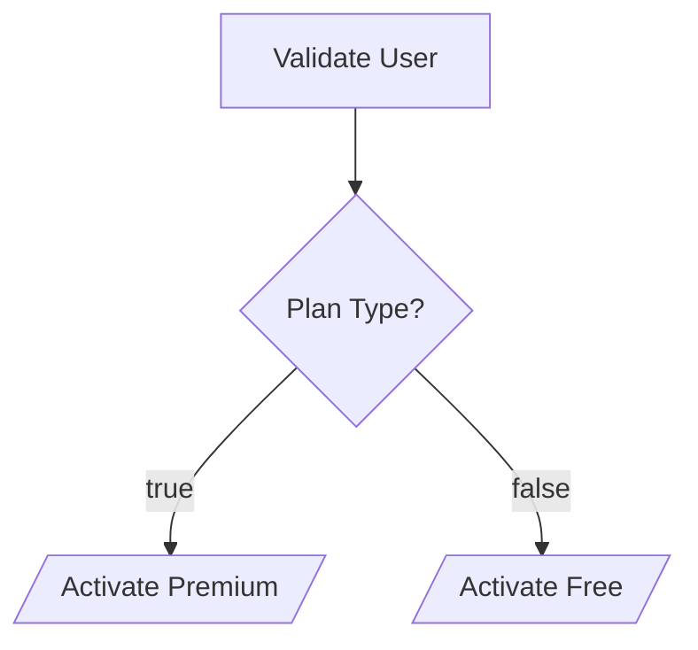

# Parevo Flow 🌌🚀
### The Ultimate High-Performance, Minimalist Workflow Engine for Go

[](https://golang.org)
[](LICENSE)
[](https://github.com/parevo/flow)
[](https://github.com/parevo/flow)

**Parevo Flow** is an enterprise-grade DAG (Directed Acyclic Graph) orchestration engine designed for Gophers who demand **Temporal-level reliability** but want **minimalist, zero-dependency performance**. It balances sub-millisecond execution speeds with bulletproof self-healing capabilities.

---

## 🏛️ Why Parevo Flow?
While others are building heavy systems that require an army of infrastructure, Parevo Flow thrives on **Minimalist Power**. 🏢⚡

- **🚀 Performance-First**: Native support for **Redis High-Speed Storage** and optimized SQL with `SKIP LOCKED` concurrency.
- **🛡️ Self-Healing Core**: Automatic **Zombie Task Recovery** (Visibility Timeout) ensures no task is ever lost if a worker crashes.
- **🧩 Advanced Logic**: Native support for **Child Workflows**, **Condition Branching**, and **Saga Patterns (Compensation)**.
- **🚦 Event-Driven & Human-Ready**: Built-in **Signal Mechanism** for external approvals and mid-workflow inputs.
- **📈 Professional Observability**: Zero-dependency **Prometheus metrics**, **Structured JSON Logging (slog)**, and **Internal Visualizer**.
- **🔐 Enterprise Security**: Built-in **AES-256-GCM Encryption** for sensitive customer PII data-at-rest.

---

## 🛠️ Masterpiece Features

### 1. 🏗️ Fluent Builder (DSL)
Build complex business logic with a type-safe, chainable Go interface. No YAML, no friction.

```go
wf := builder.NewWorkflow("user-onboarding", "SaaS Onboarding")
    .AddNode("validate", "validator").WithConfig("api_key", "secret")
    .Then("decide-plan")
    .AddNode("decide-plan", "condition").WithConfig("variable", "plan", "operator", "==", "value", "premium")
    .If("activate-pro", "true")
    .If("activate-free", "false")
    .Build()
```

### 2. 📊 Native Visualization
Instantly turn your Go code into professional diagrams for documentation.

```go
// Output a Mermaid.js string for GitHub, Notion, or Mermaid-Live
fmt.Println(wf.Visualise())
```

**Auto-generated Diagram Example:**


### 3. 🛡️ Saga Pattern (Self-Correction)
Automate rollbacks. If a task fails definitively, the engine triggers the designated compensation node.

```go
.AddNode("payment", "stripe").WithSaga("refund-payment")
```

### 4. ⏰ Cron-Style Periodic Automation
Scale your background tasks with sub-second precision using the integrated **CronManager**.

```go
cronMgr.AddSchedule("default", "daily-report", "0 9 * * *", `{"type":"full"}`)
```

### 5. ⚡ Ultra-High Throughput (Redis)
Switch from SQL to Redis in production for sub-millisecond state transitions and massive concurrency.

```go
storage := redis.NewRedisStorage("localhost:6379", "", 0)
engine := engine.NewEngine(storage, registry)
```

### 6. 🚦 Human-in-the-Loop (Signals)
Pause execution and wait for a "Signal" (e.g., Email Approval, Slack Click) to resume.

```go
// Pause at 'manager-approval' node
/api/v1/executions/{id}/signal/manager-approval --> Post '{"status": "approved"}'
```

---

## 📁 Directory Architecture
A clean, modular structure following Go best practices:

- 🧠 **`internal/engine/`**: The brain. Orchestration, Worker cycles, and Telemetry.
- 🏗️ **`internal/builder/`**: Fluent DSL and Mermaid.js Visualizer.
- 🗄️ **`internal/storage/`**: The Vault. SQL Dialects, Redis, and AES-256 Crypto.
- 🧩 **`internal/node/`**: Logic Units (Condition, Wait, HTTP, SubWorkflow, Signal).
- 🛰️ **`internal/trigger/`**: Interfaces. API, Webhooks, Metrics, and Cron.

---

## 🥇 Comparison vs. Temporal

| Feature | Temporal | Parevo Flow |
| :--- | :--- | :--- |
| **Footprint** | Heavy (Needs DB, K8s, Services) | **Ultra-Light (Single Binary / Library)** |
| **Observability** | External Dashboard | **Built-in Slog + Mermaid + Metrics** |
| **Logic Core** | Event Sourcing / Replay | **DB/Redis State Persistence** |
| **Simplicity** | High Learning Curve | **Go-Native & Minimalist** |
| **Self-Healing** | Standard | **Advanced Zombie Recovery** |

---

## 🚀 Getting Started
```bash
go get github.com/parevo/flow
```

---

## 📄 License
Proudly distributed under the **MIT License**.

---
**Parevo Flow** - *The high-performance automation hearth for modern Gophers.*  
*Built with ❤️ by Ahmet Can Bilgay.*
