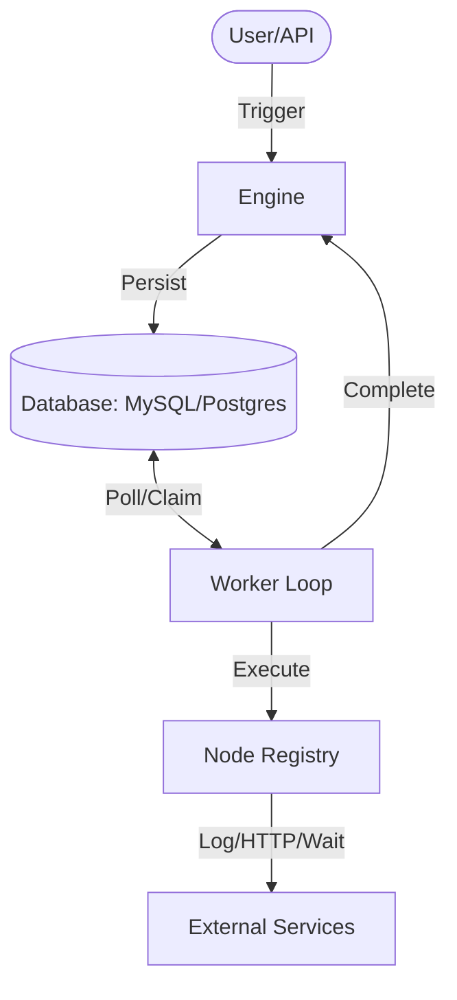

# Parevo Flow 🚀

[](https://github.com/parevo/flow/actions/workflows/ci.yml)
[](https://goreportcard.com/report/github.com/parevo/flow)
[](LICENSE)
[](https://pkg.go.dev/github.com/parevo/flow)

**Parevo Flow** is a high-performance, developer-friendly, and durable graph-based workflow engine for Go. Designed as a lightweight and explicit alternative to Temporal, it empowers SaaS developers to build complex, long-running automations with 100% state persistence and agnostic multi-tenancy.

---

## 🌟 Why Parevo Flow?

- **Explicit State Traversal**: No complex "event-sourcing" or "replay" logic. Every step's input/output is persisted in your database. debugging is trivial.
- **n8n-style Flexibility**: Define workflows as Directed Acyclic Graphs (DAGs) using JSON. Visual-ready architecture.
- **Agnostic Multi-tenancy**: Built-in `Namespace` and `Labeling` support. Works with any SaaS structure (`TenantID`, `UserID`, `ProjectID`).
- **Persistence Anywhere**: Native support for **MySQL 8.0+** and **PostgreSQL**. Uses `SKIP LOCKED` for high-concurrency worker polling.
- **Durable by Design**: If your worker crashes, it resumes exactly where it left off. No data loss.

---

## 🏗️ Architecture



---

## 🚀 Quick Start (60 Seconds)

### 1. Define your Workflow (JSON)
```json
{
  "id": "onboarding",
  "name": "User Onboarding",
  "nodes": [
    { "id": "n1", "type": "log", "config": { "message": "Welcome!" } },
    { "id": "n2", "type": "wait", "config": { "duration": "24h" } },
    { "id": "n3", "type": "http", "config": { "url": "https://api.saas.com/nudge" } }
  ],
  "edges": [
    { "sourceId": "n1", "targetId": "n2" },
    { "sourceId": "n2", "targetId": "n3" }
  ]
}
```

### 2. Run with Go
```go
package main

import (
    "parevo-lab/flow/internal/engine"
    "parevo-lab/flow/internal/storage/sql"
)

func main() {
    // 1. Connect to DB
    db, _ := sqlx.Connect("mysql", dsn)
    store, _ := sql.NewSQLStorage(db, "mysql")

    // 2. Initialize Engine
    eng := engine.NewEngine(store, registry)

    // 3. Start Workflow
    execID, _ := eng.StartWorkflow(ctx, "my-tenant", "onboarding", `{"user_id": 123}`)
    
    // 4. Start Workers
    worker := engine.NewWorker("worker-1", eng, registry, time.Second)
    worker.Start(ctx)
}
```

---

## 🛠️ Features for SaaS Builders

### Namespaces (Isolation)
Every workflow and execution lives inside a `Namespace`.
```go
// Isolated execution for Customer A
eng.StartWorkflow(ctx, "customer-a", "invoice-flow", input)
```

### Labels (Grouping)
Attach arbitrary data to workflows or executions for filtering.
```json
"labels": {
  "priority": "high",
  "department": "finance"
}
```

---

## 📦 Installation
```bash
go get github.com/parevo/flow
```

---

## 🏗️ Production Readiness (High-Load)

For handling millions of workloads, ensure your DB connection pool is tuned:

```go
db.SetMaxOpenConns(100)
db.SetMaxIdleConns(25)
db.SetConnMaxLifetime(5 * time.Minute)
```

## 🤝 Contributing
Contributions are welcome! Please see [CONTRIBUTING.md](CONTRIBUTING.md) for details.

## 📄 License
This project is licensed under the **MIT License** - see the [LICENSE](LICENSE) file for details.

---
Built with ❤️ by **Parevo Lab**.
