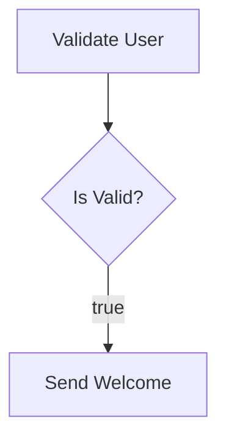

# Parevo Flow 🌌🚀

**A Lightweight, High-Performance, and Intelligent Workflow Engine in Go.**

Parevo Flow is an enterprise-grade DAG orchestration engine designed for modern SaaS architectures. It combines **extreme flexibility, Temporal-level reliability, and intelligent decision-making** with zero external dependencies for core observability.

---

## 🌟 Masterpiece Features

- **🧠 Intelligent Routing**: Built-in `ConditionNode` support for complex If-Else branching and dynamic decision trees.
- **🛡️ Enterprise Security**: Optional **AES-256-GCM** encryption for all sensitive PII data-at-rest.
- **🧟‍♂️ Self-Healing (Zombie Recovery)**: Automatic recovery from worker crashes using a 5-minute heartbeat/visibility timeout.
- **🛑 Execution Cancellation**: Instantly stop unwanted or malfunctioning workflows via the management API.
- **🚀 Dynamic Retry Engine**: Granular control with custom `RetryPolicy` (MaxAttempts, Exponential Backoff, Intervals) per node.
- **🧬 Child Workflows**: Support for modular, nested workflow execution using the `SubWorkflowNode`.
- **🔄 Saga Pattern (Compensation)**: Built-in support for rollback logic with `CompensateNodeID` on failure.
- **🏗️ Fluent Go Builder**: A type-safe, chainable DSL to build complex workflows directly in Go.
- **📈 Native Observability**: **Zero-dependency Prometheus metrics** and **Structured JSON Logging (slog)**.
- **⚡ High-Load Performance**: Optimized SQL with **Composite Indexes** and `SKIP LOCKED` concurrency.
- **📊 Native Visualization**: Instantly generate **Mermaid.js** diagrams from your Go code for documentation.

---

## 📊 Workflow Visualization

Parevo Flow can visualize your complex logic as professional diagrams. Just build and call `.Visualise()`:

```go
wf := builder.NewWorkflow("signup", "User Signup")...
fmt.Println(wf.Visualise())
```

**Output (Mermaid.js):**

> [!TIP]
> You can paste the output into GitHub, Notion, or [Mermaid Live Editor](https://mermaid.live) to see your workflow graph!

## 🏗️ Fluent Builder Example

Define complex, modular business logic with zero friction:

```go
wf := builder.NewWorkflow("signup-flow", "User Signup")
    .AddNode("validate", "http").WithConfig("url", "https://api.check.com")
    .Then("check-status")
    .AddNode("check-status", "condition").WithConfig("variable", "valid", "operator", "==", "value", true)
    .If("welcome-email", "true")
    .If("flag-user", "false")
    .Build()
```

---

## 🚀 Dynamic Retries & Saga Pattern

Parevo Flow provides hierarchical control over failures:
- **Automatic Retries**: Fine-tune backoff strategies for flaky external systems.
- **Saga Compensation**: Automate rollbacks. If a node fails definitively, the engine triggers its designated compensation path.

---

## 🛡️ Enterprise Security

Securing customer data is a single command away:
```go
crypto, _ := storage.NewCrypto("64-char-hex-encryption-key...")
sqlStore.SetEncryption(crypto) // All Input/Output data is now AES-256 secured!
```

---

## 📁 Directory Structure

```text
.
├── internal/
│   ├── builder/      # Fluent Go DSL Builders
│   ├── engine/       # Core Brain & DAG Orchestration
│   ├── storage/      # The Vault (SQL Drivers & AES-Crypto)
│   ├── node/         # Logic Nodes (Wait, Condition, HTTP, SubWorkflow, etc.)
│   └── trigger/      # Interface (API, Webhooks & Metrics)
├── tests/            # Professional Quality Gate
└── README.md         # This masterpiece
```

---

## 🚀 Quick Start
```bash
go get github.com/parevo/flow
```

---

## 📄 License
Distributed under the **MIT License**.

---
**Parevo Flow** - *Built with ❤️ for the Gopher community by Ahmet Can Bilgay.*
